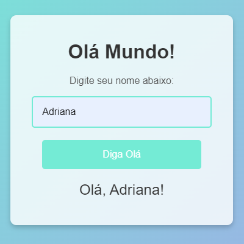

# Olá Mundo!

Este projeto é uma simples aplicação web que exibe uma saudação personalizada ao usuário, dependendo do nome digitado.

## Funcionalidades
- O usuário pode digitar seu nome em um campo de texto.
- Ao clicar no botão "Diga Olá", uma mensagem de saudação é exibida na tela com o nome fornecido.
- A interface é limpa, minimalista e responsiva.

## Tecnologias Utilizadas
- **HTML**: Estrutura da página.
- **CSS**: Estilização da interface (botão, input e layout geral).
- **JavaScript**: Funcionalidade de interação (exibir a mensagem com o nome).

## Captura de Tela
Aqui está uma visualização da interface do projeto:

## Link do Projeto
Acesse o projeto online: [Olá Mundo](https://ola-mundo-ys3p.vercel.app/)

 
